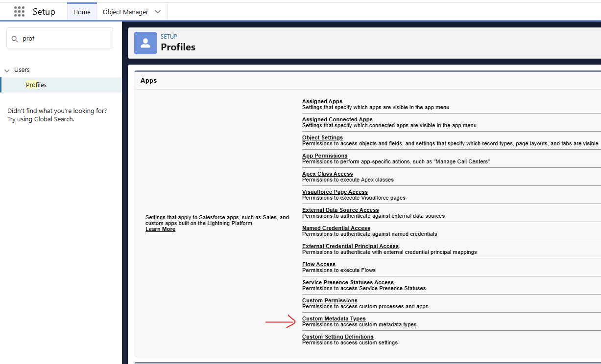
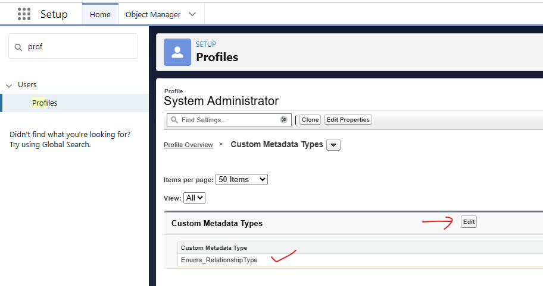

[Salesforce Lightning Component Library](https://developer.salesforce.com/docs/component-library/overview/components) currently does not have a standard multi-select combobox.

This repo includes a custom one - built using a standard combobox and a standard pill-container. Also included are:
- multiSelectExampleParent LWC for demo purposes.
- Custom Metadata Type definition and records.
- Apex class to fetch Custom Metadata Type records.

After deploying objects/Enums_RelationshipType__mdt, make sure you give access to profiles who would use them (see images).
 
